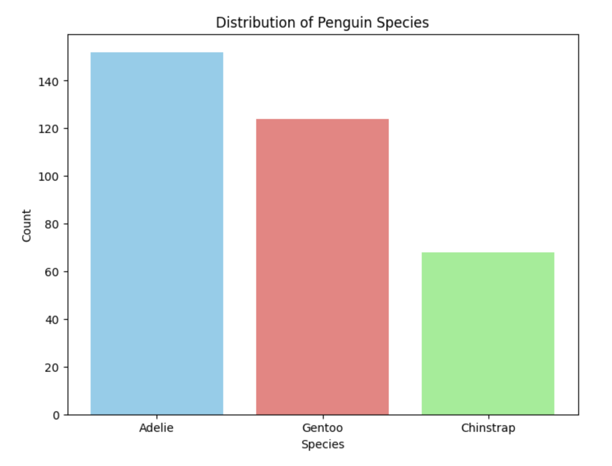
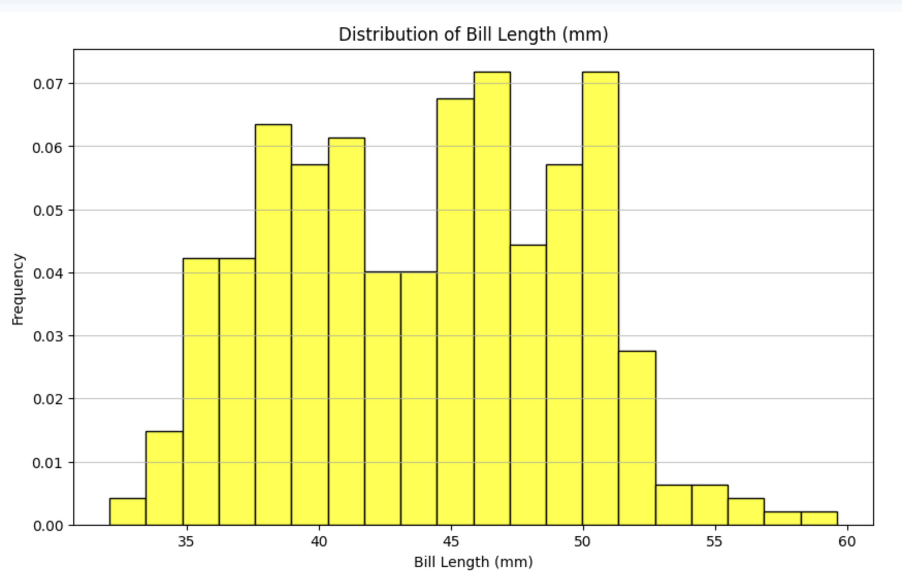
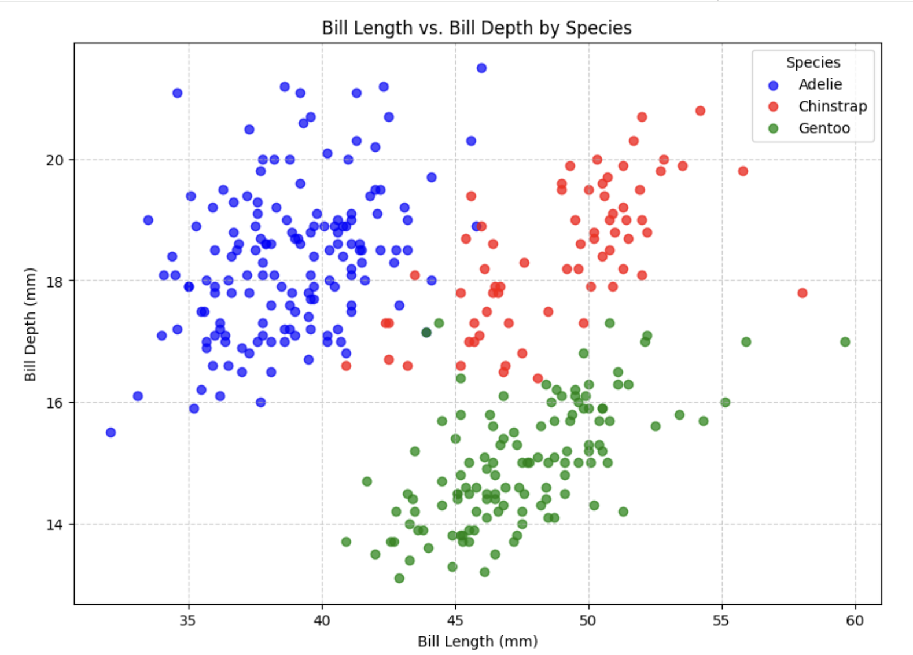
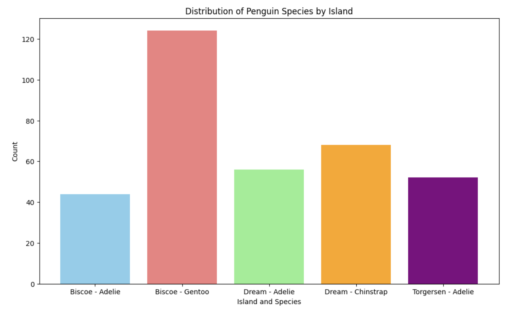

# DS 201 Final Project: Penguin Data Exploration & Visualization

## 📝Project Overview: 
> This project performs an Exploratory Data Analysis (EDA) on the Penguins dataset. The goal is to explore the data, clean missing values, and create clear visualizations to better understand biological patterns among penguin species.

### The project followed a structured data analysis workflow:
1. Data Collection  
   The dataset was obtained from the Palmer Penguins dataset.

2. Data Exploration  
   Initial exploration was performed to understand the structure of the data and identify missing values.

3. Data Cleaning  
   Missing values were handled using median and mode imputation techniques.

4. Data Visualization  
   Matplotlib was used to create visualizations that highlight biological patterns.

5. Insights & Interpretation  
   Visualizations were analyzed to extract meaningful insights about penguin species.

## 📊During the analysis, we focused on:
- Data cleaning
- Handling missing values
- Creating visualizations
- Identifying patterns and insights in the dataset

## 💻Dataset information:
The dataset contains biological measurements of penguins from three species:
- Adelie
- Chinstrap
- Gentoo
  
Main variables include:
- bill_length_mm
- bill_depth_mm
- flipper_length_mm
- body_mass_g
- species
- island
- sex

## 📈Vizualizations: 
### Species Distribution

This bar chart shows the distribution of penguin species in the dataset.

The Adelie species appears most frequently, with the highest number of observations. The Gentoo species is the second most common, while the Chinstrap species has the smallest representation in the dataset.

This distribution indicates that the dataset contains more samples of Adelie penguins, which may influence statistical analysis and visual patterns when comparing species.

 

### Bill Length Distribution

This histogram illustrates the distribution of penguin bill length measured in millimeters.

Most bill length values fall approximately between 38 mm and 50 mm, indicating that this is the most common range for penguin bill size in the dataset. The distribution shows moderate variability, with a few larger values extending beyond 55 mm.

Overall, the histogram suggests that penguin bill lengths are clustered within a central range, with fewer extreme values.

 

### Bill Length vs. Bill Depth by Species

This chart shows how different penguin species are distributed across the islands in the dataset.

The Gentoo species appears primarily on Biscoe Island, where it has the highest count among the groups shown. The Adelie species is distributed across multiple islands, including Biscoe, Dream, and Torgersen, indicating a wider geographical presence.

The Chinstrap species appears mainly on Dream Island, suggesting that this species may be more geographically concentrated in the dataset.

Overall, the chart highlights how penguin species are associated with specific islands, which may reflect differences in habitat or environmental conditions.

 

### Distribution of Penguin Species by Island

This scatter plot shows the relationship between bill length and bill depth for different penguin species. Each point represents an individual penguin, and the colors distinguish the three species: Adelie, Chinstrap, and Gentoo.

The plot reveals clear clustering patterns among the species. Adelie penguins generally have shorter bill lengths but deeper bills, appearing mostly on the left side of the chart with relatively higher bill depth values. Chinstrap penguins tend to have longer bills with moderate depth, forming a cluster toward the middle-right of the plot.

In contrast, Gentoo penguins typically have longer bill lengths but noticeably shallower bill depths, appearing in the lower-right area of the chart.

Overall, the visualization highlights how bill length and bill depth vary by species, suggesting that these two measurements can help differentiate penguin species based on their physical characteristics.

 

## 💡Key Insights
### Some interesting patterns observed during the analysis:
- Gentoo penguins tend to have larger body mass compared to other species.
- Adelie penguins show smaller bill length on average.
- There is a positive relationship between flipper length and body mass.

## 📚Key Learnings
### Through this project, we practiced a real-world data science workflow, including:
- Performing exploratory data analysis (EDA)
- Creating professional visualizations using Matplotlib
- Collaborating using GitHub
This project helped us better understand how data analysis can be used to identify patterns and communicate insights effectively.

## 🛠️Tools Used
- **Python (Pandas)**: Used for data manipulation, cleaning, and preparation.
- **Matplotlib**: For all professional visualizations (Strictly no Seaborn/Plotly for charts).
- **GitHub**: Used for version control and collaboration between team members.

## 🪜Repository Structure
- `Final_Project_DS201.ipynb`: The main Python Notebook containing all code and plots.
- `penguins.csv`: The raw dataset used for the analysis.
- `Project_Report.pdf`: The comprehensive technical report.
- `README.md`: Project documentation (this file).

## ⚙️How to Run the project: 
1. Clone the repository git clone [this repository](https://github.com/chungvong575-bit/DS201-Final-Project-Penguins)

2. Install required libraries pip install
   - pip install pandas
   - pip install matplotlib
   - pip install jupyter

3. Run the notebook jupyter notebook
   - Final_Project_DS201.ipynb

## ⭐️Team Members & Responsibilities
- **Eduardo Carreno**: Lead Coder (Data Exploration, Cleaning & Matplotlib Charts)
- **Maria**: Documentation Specialist (Dataset Description & Visual Analysis)
- **Gabriel**: Insight Analyst (Key Findings & Final Report Synthesis)
- **Chung Vong**: Repository Manager (GitHub Management, Data Hosting & Documentation)

## 📍Data Source
### The dataset is based on the Palmer Penguins dataset.
Source:
https://allisonhorst.github.io/palmerpenguins/

